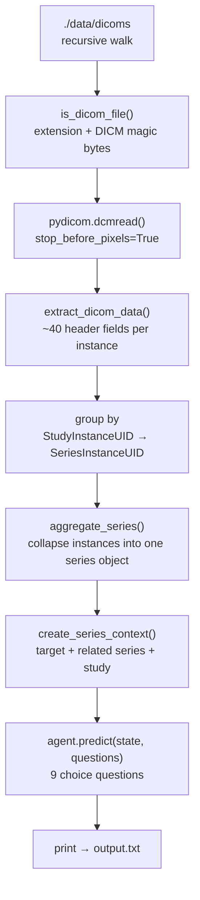

# How the code works

`main.py` is a single-file, script-style pipeline (1,493 lines, no CLI arguments, no package
layout). It turns a folder of DICOM files into a set of BIDS-entity predictions made by the
**Laya** decision model, and prints everything to stdout.

```
python main.py > output.txt
```

The repository contains no `requirements.txt`; the imports actually used are `pydicom` and
`laya` (plus the Python standard library).

---

## 1. Pipeline overview



| Stage | Function | Lines |
|---|---|---|
| Model loading | module-level `laya.load(...)` | 22 |
| File discovery | `is_dicom_file`, `discover_dicom_files` | 29–63, 603–620 |
| Header reading | `read_dicom` | 113–132 |
| Evidence extraction | `extract_dicom_data` (+ helpers) | 70–106, 139–409 |
| Hierarchy building | `unique_values`, `aggregate_series`, `discover_studies` | 416–697 |
| State construction | `create_series_context` | 704–899 |
| Console reporting | `print_structure` | 906–1005 |
| Question definitions | `questions` dict | 1012–1320 |
| Classification loop | `classify_studies` | 1327–1459 |
| Entry point | `if __name__ == "__main__"` | 1466–1493 |

---

## 2. Stage by stage

### 2.1 Loading the model (line 22)

```python
agent = laya.load("convaiinnovations/laya")
```

The model is loaded at **import time** (module level), so merely importing `main.py` triggers a
Hugging Face Hub lookup/download. Two environment variables are set before the imports to keep
the console clean (`HF_HUB_DISABLE_PROGRESS_BARS`, `TRANSFORMERS_VERBOSITY=error`) and Laya's
`RuntimeWarning` is filtered out.

### 2.2 File discovery (lines 29–63, 603–620)

`discover_dicom_files(root)` walks `root.rglob("*")` and keeps every file that passes
`is_dicom_file()`, which uses three checks in order:

1. `.dcm` / `.ima` extension → accept.
2. Known non-DICOM extensions (documents, archives, images, audio, NIfTI, JSON/YAML/XML,
   source code, logs) → reject. This is what keeps `inventory.tsv` out of the scan.
3. Otherwise read bytes `128..132` and accept only if they equal the DICOM magic `b"DICM"`.

Step 3 matters because real DICOM datasets routinely contain files with no extension at all.

> In this run the scan root is hard-coded to `./data/dicoms` (line 1469), so the two loose
> `data/dicom-0000X.dcm` files and `data/inventory.tsv` sitting one level up are **not** scanned.
> Result: `Found 394 possible DICOM files.`

### 2.3 Reading headers only (lines 113–132)

```python
pydicom.dcmread(str(path), stop_before_pixels=True, force=True)
```

- `stop_before_pixels=True` → pixel data is never loaded into memory; the pipeline is a pure
  **metadata** pipeline. It runs in seconds regardless of image size.
- `force=True` → tolerate files with a broken/missing preamble.
- Any exception prints `[WARNING] Could not read DICOM ...` and returns `None`, so one corrupt
  file cannot abort the run.

### 2.4 Extracting evidence from one instance (lines 139–409)

`extract_dicom_data(ds, path)` builds a flat dictionary of roughly 40 fields, grouped in the
source as: file path, DICOM relationships (Study/Series/SOP Instance UIDs), modality, series
information, sequence information, study information, acquisition information, echo information,
MR parameters, image dimensions, spatial information, phase encoding, scanner information and a
`has_pixel_data` flag.

Three helpers are used throughout:

| Helper | Behaviour |
|---|---|
| `normalize_image_type` | `ImageType` may be a list, a `MultiValue` or a `"A\B\C"` string — all are normalised to a plain Python list. |
| `get_value(ds, name, default="")` | `getattr(ds, name, default)`, `None` → default, then `str(...).strip()`. Never raises. |
| `get_numeric_value` | An alias of `get_value` — numbers are deliberately kept as **strings** to match Laya's original input representation. |

Note `in_plane_phase_encoding_direction` and `in_plane_phase_encoding_direction_dicom` are two
keys that read the *same* DICOM tag (lines 370–378) — harmless, but redundant.

### 2.5 Building the Study → Series hierarchy (lines 416–697)

1. `discover_studies()` reads every discovered file once and buckets it into
   `grouped[StudyInstanceUID][SeriesInstanceUID] = [instance, ...]`.
2. `aggregate_series(instances)` collapses each bucket into **one series-level object**:
   - for each of 28 series-level fields, all instance values are collected with
     `unique_values()` (order-preserving, empties dropped);
   - one distinct value → stored as a scalar, several distinct values → stored as a list
     (so intra-series disagreement is visible to the model instead of being silently averaged);
   - `image_type` is the **union** over all instances;
   - plus `acquisition_times`, `instance_numbers`, `number_of_dicom_files`,
     the two UIDs, and the list of `files`.

The result is a two-level dictionary:

```
studies[study_uid][series_uid] = {
    # 28 aggregated series fields
    'modality': 'MR',
    'series_description': 'ses-pre_T1w',
    ...
    'image_type': ['ORIGINAL', 'PRIMARY', 'M', 'NONE'],
    'acquisition_times': [], 'instance_numbers': ['1'],
    'number_of_dicom_files': 1,
    'study_instance_uid': '...', 'series_instance_uid': '...',
    'files': ['data/dicoms/OL_0003/....dcm'],
}
```

### 2.6 Building the state given to Laya (lines 704–899)

`create_series_context(target_series, all_series)` returns a three-part state. This is the
crucial design idea of the project — the model is not shown one series in isolation, it is shown
the series **in the context of its siblings**, which is how entities like `run`, `echo` and
field-map pairs can be resolved.

| State key | Content | Size in this run |
|---|---|---|
| `target_series` | Full series object, with `files` stripped out (no file paths leave the pipeline) | 34 keys |
| `related_series` | Compact view of every *other* series in the same study: 16 keys each (UID, number, description, protocol, sequence name, modality, scanning/variant/acquisition type, image type, TE, echo number, TR, flip angle, TI, number of DICOM files) | 8 / 9 / 16 series for studies 1 / 2 / 3 |
| `study` | `study_instance_uid`, `study_description`, `study_date`, `study_time`, `number_of_series` | 5 keys |

Measured size of the printed states: **5.3 KB – 10.1 KB, mean 7.5 KB** of text per `predict()`
call (36 calls → one per series).

### 2.7 The questions (lines 1012–1320)

All nine questions share the same schema — `type: "choice"`, a natural-language `instructions`
string, and a `criteria` map where **every option carries its own explanatory text**:

| Question | Options | Purpose |
|---|---|---|
| `datatype` | 7 — anat, func, dwi, fmap, perf, pet, mrs | BIDS data type |
| `suffix` | 34 — T1w, T2w, FLAIR, bold, sbref, dwi, epi, phasediff, magnitude1/2, phase1/2, TB1\*, T1map, T2map, ASL, … | BIDS suffix |
| `part` | 4 — mag, phase, real, imag | `_part-` entity (complex/field-map images) |
| `direction` | 6 — i, i-, j, j-, k, k- | `_dir-` entity (phase-encoding axis) |
| `run` | 9 — 1…9 | `_run-` entity |
| `echo` | 9 — 1…9 | `_echo-` entity |
| `flip` | 5 — 1…5 | `_flip-` index |
| `inversion` | 5 — 1…5 | `_inv-` index |
| `mt` | 2 — on, off | `_mt-` entity (magnetisation transfer) |

The `criteria` text is the only guidance the model gets — there is **no example, no
few-shot context, and no label of "not applicable"** on any question.

### 2.8 Classification loop and output (lines 1327–1493)

For each study, for each series, `classify_studies()`:

1. prints a banner with the series UID, number, description, protocol and instance count;
2. prints `"State for Laya:"` followed by the full state dict;
3. calls `agent.predict(state, questions)` →
   `{"answers": {question: {"choice": ..., "probabilities": {option: p, ...}}}}`;
4. prints the chosen answer **and the whole probability table** for every question;
5. appends `{"study_instance_uid", "series_instance_uid", "series_number",
   "series_description", "result"}` to `all_results`.

`print_structure()` prints the discovered hierarchy beforehand, so `output.txt` has a
discovered-structure section followed by 36 target-series sections.

> ⚠️ `all_results` is **returned but never written anywhere** — no JSON/CSV file is produced.
> `output.txt` (a capture of stdout) is currently the *only* result artifact in the project.

---

## 3. Design observations and limitations

These are the things worth knowing before reading the [results](results.md):

1. **No "not applicable" option.** Every one of the 9 questions is asked for *every* series,
   including localizers (`AAHead_Scout_*`), DICOM structured reports (`PhoenixZIPReport`,
   modality `SR`) and physiology logs (`*_PhysioLog`), none of which have a BIDS equivalent.
   The model is forced to invent an answer for 15 of the 36 series.
2. **`part`, `flip`, `inversion`, `mt` are niche entities** that only apply to a minority of
   sequences, yet they are asked with the same weight as `datatype`.
3. **Many of the fields that would justify those answers are empty in this dataset** — see the
   evidence-gap table in [results.md](results.md#3-evidence-gaps-in-the-state).
4. **Nothing is persisted.** Adding a `json.dump(all_results, ...)` at the end would make the
   results machine-readable instead of requiring a regex pass over a 5,328-line log.
5. **`force=True` + extension checks** are pragmatic, but a stricter validation (e.g. checking
   `SOPClassUID`) would be safer on messy folders.
6. **State size grows linearly** with the number of series in a study (8 → 16 related series
   between study 1 and study 3). A 100-series study would produce a very large prompt.
7. **Duplicate key** `in_plane_phase_encoding_direction` / `..._dicom`, and
   `get_numeric_value` is currently a no-op alias.
8. **No pinned dependencies** (`requirements.txt` / `pyproject.toml`) and no tests.

---

## 4. Where the numbers in this report come from

`report/output.txt` is a verbatim copy of the run log. The tables in
[results.md](results.md) and [per-series-predictions.md](per-series-predictions.md) were
produced by parsing that log (target-series headers, `Question:`/`Answer:` blocks and their
`probabilities` tables) and joining them with the discovered-structure section of the same log.
The extracted rows are also available as [results.csv](results.csv).

---

[Back to the main report](README.md)
